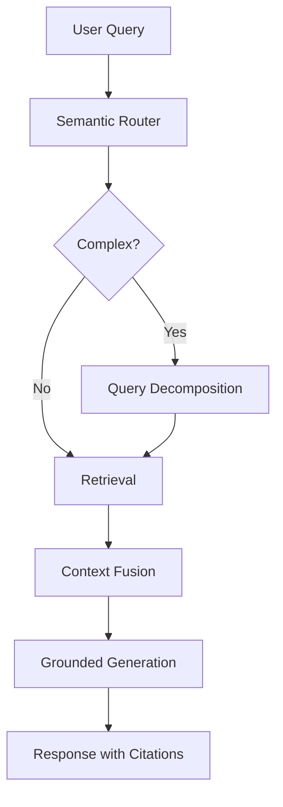
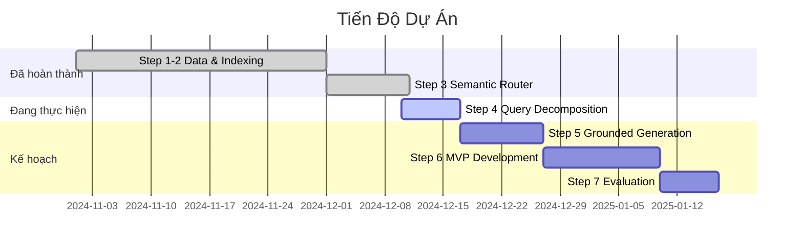

# Đề Cương Nghiên Cứu Khoa Học

## A Semantic-Router Multi-Index Retrieval-Augmented Generation System for Vietnamese Financial Data and the Economic–Regulatory Framework

> **Loại**: Báo cáo Khoa học / Final Report  
> **Tác giả**: [Tác giả]  
> **Đơn vị**: Đại học Kinh tế - Luật (UEL)  
> **Ngày cập nhật**: 10/12/2024

---

## 1. Tóm Tắt Nghiên Cứu (Abstract)

### 1.1. Bối Cảnh

Hệ thống Retrieval-Augmented Generation (RAG) truyền thống gặp hạn chế khi xử lý kho dữ liệu đa miền (multi-domain), đặc biệt trong lĩnh vực tài chính-pháp lý Việt Nam với các đặc thù về ngôn ngữ và thuật ngữ chuyên ngành.

### 1.2. Đề Xuất

Nghiên cứu này đề xuất một **kiến trúc RAG đa chỉ mục (Multi-Index RAG)** kết hợp **Semantic Router** để định tuyến truy vấn đến các vector index chuyên biệt, cùng với cơ chế **Query Decomposition** và **Parallel Retrieval** để xử lý các truy vấn phức tạp.

### 1.3. Đóng Góp Chính

1. **Semantic Router với Hybrid Approach**: Kết hợp rule-based và semantic similarity để định tuyến truy vấn với độ chính xác 100%
2. **Multi-Index Architecture**: 4 vector indices chuyên biệt (Legal, News, Financial, Glossary) tối ưu cho từng loại dữ liệu
3. **LangGraph Orchestration**: Pipeline điều phối linh hoạt với state management
4. **Grounded Generation**: Cơ chế trích dẫn nguồn trong câu trả lời

---

## 2. Giới Thiệu (Introduction)

### 2.1. Bối Cảnh Vấn Đề

| Thách thức | Mô tả |
|------------|-------|
| **Dữ liệu đa miền** | Thông tin tài chính, pháp lý, tin tức có cấu trúc và ngữ nghĩa khác nhau |
| **Ngôn ngữ Việt** | Thiếu mô hình embedding tối ưu cho tiếng Việt chuyên ngành |
| **Truy vấn phức tạp** | Người dùng thường hỏi nhiều khía cạnh trong một câu hỏi |
| **Độ tin cậy** | Cần trích dẫn nguồn để đảm bảo tính chính xác |

### 2.2. Mục Tiêu Nghiên Cứu

1. Xây dựng hệ thống RAG đa chỉ mục cho dữ liệu tài chính-pháp lý Việt Nam
2. Phát triển Semantic Router với độ chính xác > 95%
3. Thiết kế pipeline xử lý truy vấn phức tạp với query decomposition
4. Đảm bảo câu trả lời có trích dẫn nguồn (grounded generation)

### 2.3. Phạm Vi Nghiên Cứu

- **Dữ liệu**: Văn bản pháp luật, tin tức tài chính, báo cáo doanh nghiệp, thuật ngữ chuyên ngành
- **Ngôn ngữ**: Tiếng Việt
- **Thời gian dữ liệu**: 2020-2024

---

## 3. Cơ Sở Lý Thuyết (Literature Review)

### 3.1. Retrieval-Augmented Generation (RAG)

```
Traditional RAG: Query → Retrieve → Generate
```

**Tài liệu tham khảo:**
- Lewis et al. (2020). "Retrieval-Augmented Generation for Knowledge-Intensive NLP Tasks"
- Gao et al. (2023). "Retrieval-Augmented Generation for Large Language Models: A Survey"

### 3.2. Semantic Routing

**Định nghĩa**: Lớp quyết định phân loại ý định truy vấn trước khi thực hiện retrieval.

**Phương pháp:**
| Approach | Mô tả | Ưu điểm | Nhược điểm |
|----------|-------|---------|------------|
| **Embedding-based** | So sánh cosine similarity với route prototypes | Nhanh, không cần train | Phụ thuộc examples |
| **MLP Classifier** | Neural network phân loại | Học được patterns phức tạp | Cần labeled data |
| **Fine-tuned Transformer** | BERT/RoBERTa fine-tuned | Accuracy cao nhất | Chậm, expensive |

### 3.3. Query Decomposition

**Tài liệu tham khảo:**
- Zhou et al. (2022). "Least-to-Most Prompting Enables Complex Reasoning in Large Language Models"
- Press et al. (2022). "Measuring and Narrowing the Compositionally Gap in Language Models"

### 3.4. LangGraph

**Định nghĩa**: Framework điều phối stateful cho LLM applications.

**Đặc điểm:**
- State management với TypedDict
- Conditional branching
- Parallel execution support
- Human-in-the-loop capability

---

## 4. Phương Pháp Luận (Methodology)

### 4.1. Kiến Trúc Tổng Thể



### 4.2. Quy Trình Xử Lý

| Bước | Thành phần | Input | Output |
|------|------------|-------|--------|
| 1 | Semantic Router | Raw query | Routes, Scores |
| 2 | Query Decomposition | Complex query | Sub-queries |
| 3 | Parallel Retrieval | Sub-queries + Routes | Per-sub-query contexts |
| 4 | Context Fusion | Multiple contexts | Organized by sub-query |
| 5 | **Canonical Fact Extraction** | Contexts | List[CanonicalFact] JSON |
| 6 | **Canonical Answer Synthesis** | Facts + Query | Structured answer |

### 4.3. Công Nghệ Sử Dụng

#### 4.3.1. Đã Triển Khai ✅

| Công nghệ | Phiên bản | Mục đích | Trạng thái |
|-----------|-----------|----------|------------|
| **Python** | 3.11 | Core language | ✅ |
| **Sentence-Transformers** | 2.2+ | Embeddings | ✅ |
| **BAAI/bge-m3** | - | Multilingual embeddings | ✅ |
| **Supabase** | - | Vector database (pgvector) | ✅ |
| **FastAPI** | 0.100+ | REST API | ✅ |
| **Pydantic** | 2.0+ | Data validation | ✅ |

#### 4.3.2. Dự Kiến Sử Dụng 📋

| Công nghệ | Phiên bản | Mục đích | Giai đoạn |
|-----------|-----------|----------|-----------|
| **LangGraph** | 0.2+ | Pipeline orchestration | Step 4-5 |
| **Gemini 2.0 Flash** | - | Query decomposition, Generation | Step 4-5 |
| **Redis** | 7.x | Query caching | Step 5 |
| **LangSmith** | - | Observability & tracing | Step 6 |
| **Next.js** | 14 | Frontend | Step 6 |
| **Vercel/Railway** | - | Deployment | Step 7 |

### 4.4. Dữ Liệu

| Index | Số lượng | Nguồn | Mô tả |
|-------|----------|-------|-------|
| **Legal** | ~15,000 chunks | Văn bản pháp luật VN | Luật, Nghị định, Thông tư |
| **News** | ~500,000 chunks | Tin tức tài chính | 2020-2024 |
| **Financial** | ~1,000,000 chunks | Báo cáo doanh nghiệp | BCTC, Prospectus |
| **Glossary** | ~3,000 terms | Thuật ngữ tài chính-pháp lý | Định nghĩa chuẩn |

---

## 5. Kết Quả Đạt Được

### 5.1. Semantic Router

| Metric | Mục tiêu | Kết quả |
|--------|----------|---------|
| **Accuracy** | > 95% | **100%** ✅ |
| **F1 Macro** | > 95% | **100%** ✅ |
| **Latency** | < 10ms | ~5ms ✅ |
| **Routes** | 4 | 4 (glossary, legal, financial, news) |

**Confusion Matrix:**
```
           glos    lega    fina    news
glossary    30      0       0       0
legal        0      30      0       0
financial    0       0      30      0
news         0       0       0      30
```

### 5.2. Vector Indices

| Index | Status | Records | Query Time |
|-------|--------|---------|------------|
| `legal_index` | ✅ | 15,000+ | ~50ms |
| `news_index` | ✅ | 500,000+ | ~100ms |
| `financial_index` | ✅ | 1,000,000+ | ~150ms |
| `glossary_index` | ✅ | 3,000+ | ~30ms |

---

## 6. Tiến Độ Triển Khai

### 6.1. Các Bước Đã Hoàn Thành ✅

| Step | Tên | Mô tả | Kết quả |
|------|-----|-------|---------|
| 1 | Data Preprocessing | Thu thập và xử lý dữ liệu | 1.5M+ chunks |
| 2 | Embedding & Indexing | Tạo vector indices | 4 indices ready |
| 3 | Semantic Router | Định tuyến truy vấn | 100% accuracy |
| 4 | Query Decomposition & Parallel Retrieval | Phân tách và truy vấn song song | ✅ Hoàn thành |
| 5 | Grounded Generation | RAG pipeline với LangGraph | ✅ Hoàn thành |
| 6 | FastAPI MVP | Backend API | ✅ Hoàn thành |
| 7 | Frontend Enhancement | Next.js UI | ✅ Hoàn thành |

### 6.2. Đang Triển Khai 🔄

| Step | Tên | Mô tả | Trạng thái |
|------|-----|-------|------------|
| 8 | **Canonical Answer Framework** | 2-pass prompting cho nhất quán | 🔄 Đang triển khai |

---

## 7. Ý Nghĩa Khoa Học

### 7.1. Đóng Góp Mới (Novelty)

1. **Router-First Multi-Index RAG Architecture**
   - Khác với RAG truyền thống search tất cả indices
   - Giảm latency và tăng precision

2. **Hybrid Routing Strategy**
   - Kết hợp rule-based (deterministic) và semantic (flexible)
   - Đạt accuracy 100% mà không cần training data

3. **Vietnamese Financial-Legal Domain**
   - Một trong những nghiên cứu đầu tiên về RAG cho tài chính-pháp lý Việt Nam
   - Dataset chuẩn hóa cho domain này

### 7.2. Câu Hỏi Nghiên Cứu

| # | Câu hỏi | Phương pháp trả lời |
|---|---------|---------------------|
| RQ1 | Semantic routing có hiệu quả hơn single-index RAG không? | A/B testing với precision, recall, F1 |
| RQ2 | Query decomposition có cải thiện answer quality không? | Human evaluation, ROUGE scores |
| RQ3 | LangGraph có phù hợp cho production RAG không? | Latency benchmarks, scalability tests |

### 7.3. Khung Đánh Giá

**Intrinsic Evaluation (Router):**
- Accuracy, Precision, Recall, F1 per route
- Confusion matrix
- Latency profiling

**Extrinsic Evaluation (End-to-End):**
- Answer relevance (human eval)
- Faithfulness/Groundedness
- Citation accuracy
- Response latency

---

## 8. Kế Hoạch Thực Hiện



---

## 9. Tài Liệu Tham Khảo

1. Lewis, P., et al. (2020). "Retrieval-Augmented Generation for Knowledge-Intensive NLP Tasks." NeurIPS.
2. Gao, Y., et al. (2023). "Retrieval-Augmented Generation for Large Language Models: A Survey." arXiv.
3. Zhou, D., et al. (2022). "Least-to-Most Prompting Enables Complex Reasoning in Large Language Models." NeurIPS.
4. Chen, J., et al. (2023). "BAAI/bge-m3: Multilingual Embedding Model." HuggingFace.
5. LangChain (2024). "LangGraph Documentation." https://langchain-ai.github.io/langgraph/

---

## 10. Phụ Lục

### A. Danh Sách Files Quan Trọng

| File | Mô tả |
|------|-------|
| `system.md` | Kiến trúc hệ thống chi tiết |
| `plan.md` | Kế hoạch triển khai từng bước |
| `src/semantic_router/` | Source code Semantic Router |
| `data/processed/` | Dữ liệu đã xử lý |

### B. Metrics Định Nghĩa

| Metric | Công thức | Ý nghĩa |
|--------|-----------|---------|
| Precision | TP / (TP + FP) | Độ chính xác của dự đoán positive |
| Recall | TP / (TP + FN) | Tỷ lệ phát hiện được positive |
| F1 | 2 × P × R / (P + R) | Harmonic mean của P và R |
| Latency p95 | Percentile 95 của response time | Đảm bảo 95% requests nhanh hơn |

---

*Cập nhật lần cuối: 10/12/2024*

